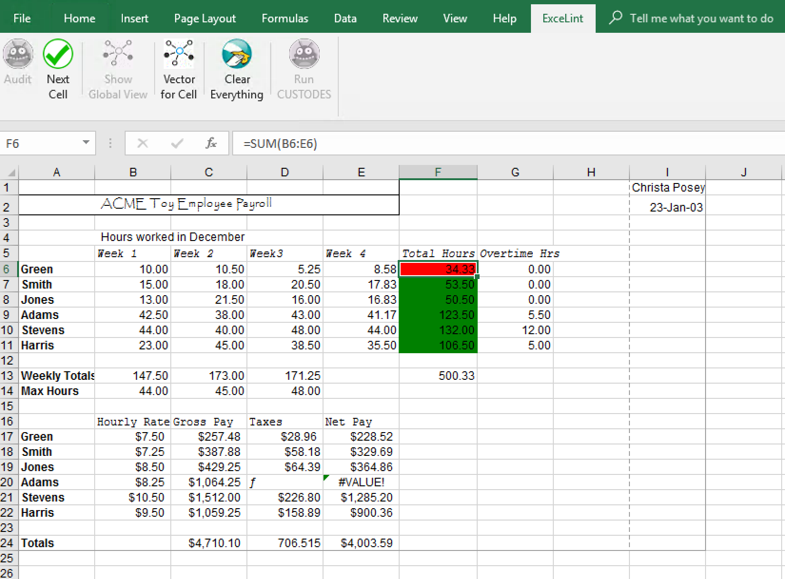

# ExceLint

ExceLint is an Excel add-in that automatically finds formula errors in spreadsheets.

By [Dan Barowy](http://www.cs.williams.edu/~dbarowy/) (Williams College), [Emery Berger](https://www.emeryberger.com/) (UMass Amherst / Microsoft Research), and [Ben Zorn](https://www.microsoft.com/en-us/research/people/zorn/) (Microsoft Research).

## Table of Contents

* [Installation](#installation)
* [A Short ExceLint Tutorial](#a-short-excelint-ui-tutorial)
	* [Proposed Fix Tool](#proposed-fix-tool-step-by-step-audit)
	* [Global View](#global-view)
* [Troubleshooting](#troubleshooting)
* [Paper](#paper)

## Installation

You will need the following software before installing:

1. Microsoft Windows 10 or Microsoft Windows Server 2016
1. Microsoft Office 365 (Office 2016):
   * For a free education license: [https://products.office.com/student/office-in-education](https://products.office.com/student/office-in-education)
   * Alternatively, download the free trial: [https://www.microsoft.com/en-us/evalcenter/evaluate-office-365-proplus#description_11711](https://www.microsoft.com/en-us/evalcenter/evaluate-office-365-proplus#description_11711) (free trial may require a credit card)

### Instructions:

1. Download the latest ExceLint [release](https://github.com/ExceLint/ExceLint/releases/download/v1.2/ExceLintInstaller.exe).
1. Double-click on the `ExceLintInstaller.exe` installer.
1. Follow the prompts to complete installation.
1. Start Microsoft Excel.
1. There should be an ExceLint tab available on the Excel ribbon.  If the ExceLint tab is missing, see the [Troubleshooting](#troubleshooting) section.

## A Short ExceLint UI Tutorial

1. Launch `Excel`.
2. Click `Open Other Workbooks`
3. Select an Excel file (workbook) of your choosing.  A good first demonstration is the benchmark file `act3_lab23_posey.xls`, which is small enough to examine fully.
4. After opening your workbook, look for the `ExceLint` tab in the Excel ribbon.  If this is the only Excel plugin you have installed, it will be the rightmost tab in the ribbon.  Click on the `ExceLint` tab.

**Note: You may want to refer to the Troubleshooting section below as Excel's security mechanisms sometimes prevent the ExceLint user interface from running; we detail solutions for common problems in that section.**

### Proposed Fix Tool (step-by-step audit)

1. To ask ExceLint for a step-by-step guided audit _for the current worksheet_, click the `Audit`  button.
2. After a brief analysis delay (you should see a progress bar), ExceLint will highlight a suspected formula error, if it locates one.
	* Two groups of cells are highlighted: the suspected error in red, and a group of closely related formulas in green.
	 
	* You should interpret this display as suggesting a "proposed fix."  The visualization is suggesting that the cell(s) highlighted in red should be rewritten to have the same _reference shape_ (see glossary) as the the cells(s) highlighted in green.
	* To see Excel's formula view, press ``Ctrl-` ``
3. To obtain the next error candidate, click the `Next Cell`  button.
4. To stop the audit, click the `Clear Everything`  button.

Note that the tool currently does not make any provisions for users changing (e.g., fixing) cells while an audit is in progress.  Such changes will not be reflected in the analysis unless it is re-run.

### Global view

The global view provides a global visualization of all the regions of the current worksheet.  Click the `Show Global View`   button to see the visualization.  Click `Hide Global View` to clear the visualization.

You should interpret each contiguous region of cells having the same color as having the same reference shape.  Note that to cut down on visual clutter, the coloring algorithm does not assign colors to whitespace or strings, and all numeric data is given the same color.

Our preferred manner of working with ExceLint is to switch between the Proposed Fix Tool and the Global View.  The Proposed Fix Tool quickly identifies potential problems while the Global View provides context that sometimes helps determine whether a flagged cell is truly a bug.

## Building and Running ExceLint from Source Code

You may download the latest source code for ExceLint using `git`.  ExceLint is a Visual Studio 2017 solution.

Run:

`$ git clone --recursive https://github.com/ExceLint/ExceLint.git`

We do a `--recursive` checkout above because ExceLint depends on a number of subprojects developed by our group.  The following table describes the libraries used by ExceLint in the ExceLint solution.  Some of these projects are for ancillary software used to research purposes.

### Solution Walkthrough

|library|purpose|language|
|-------|-------|--------|
|`AnnotationStats`|A console program that prints statistics about the ground truth annotations|F#|
|`COMWrapper`|A wrapper that ensures that reference-counted Excel COM objects are correctly disposed of by managed (.NET) code.|C#|
|`COMWrapperTests`|A unit test suite for `COMWrapper`.|C#|
|`CUSTODESParser`|A parser for CUSTODES tool outputs.|F#|
|`Depends`|A library that efficiently extracts a spreadsheet's dependence graph.|C#|
|`DependsTests`|A unit test suite for `Depends`|C#|
|`ExceLint`|**This library contains the core static analysis.**|F#|
|`ExceLintCLIGenerator`|A defunct UI used during development to make it easy to call the benchmark runner|C#|
|`ExceLintFileFormats`|A library that defines file formats needed by the ExceLint runner to read input files and to produce output files.|C#|
|`ExceLintInstaller`|An InstallShield project used to produce the release installer used for this project.|InstallShield|
|`ExceLintRunner`|A console program used to run ExceLint in benchmark mode.|F#|
|`ExceLintRunnerTests`|A unit test suite for `ExceLintRunner`|C#|
|`ExceLintTests`|A unit test suite for `ExceLint`|C#|
|`ExceLintUI`|**This library is the top-level project that produces a plugin for Microsoft Excel.**  It is implemented using the Visual Studio Tools for Office (VSTO) API.  The ExceLint UI manages the UI layer, mostly forwarding calls to the `ExceLint` library.|C#|
|`ExcelParser`|A parser that produces ASTs for Excel formulas.|F#|
|`ExcelParserConsole`|A console program that displays the AST for a given Excel formula|F#|
|`FParsec`|A third-party parser combinator library.|F#|
|`FParsecCS`|Low-level routines for `FParsec`|C#|
|`ParcelCOMShim`|A library that facilitates calling `ExcelParser` on Excel COM types|F#|
|`ParcelTest`|Unit test suite for `ExcelParser`|C#|
|`StatsGatherer`|A console program that crawls a collection of Excel workbooks and gathers statistics about them|F#|

### Building ExceLint

You will need an installed copy of Microsoft Visual Studio 2017 in order to build ExceLint.

1. Open the `ExceLint.sln` file using Visual Studio.
2. Right-click on the `ExceLintUI` project in the `Solution Explorer` pane and select `Set as StartUp Project`.
3. Select the `Debug` -> `Start Debugging` option from the menu.  This will compile ExceLint, install the VSTO plugin into Excel, and start Excel in a debugging session.  You can set breakpoints in Visual Studio, which may be triggered by interacting with the plugin.

## Troubleshooting

A variety of problems can occasionally pop up when using or building ExceLint.

**Problem:** ExceLint does nothing when I click on the buttons in the UI.

**Solution:** Excel will not allow ExceLint to run when it is in "Protected Mode".  If it is, there will be a yellow bar across the top of the spreadsheet to that effect.  You will need to click the `Enable Editing` button to allow ExceLint to run.

**Problem:** You started the ExceLint runner but had to force quit it using Ctrl-C.  Now there are a bunch of `excel.exe` instances running in the background.

**Solution:** You can force quit all running instances of Excel by typing `taskkill /f /im excel.exe` into the `cmd.exe` command prompt.

**Problem:** The `Clear Everything` button does not clear everything.

**Solution:** We occasionally find and try to squash bugs where the UI is out of sync with the analysis.  We may have missed a corner case or two.  If you find that you cannot clear visualizations, close the reopen the workbook **without saving the workbook**.  *It is important that you do not save the workbook when you close it, otherwise the visualizations themselves will overwrite the default formatting in the workbook!*

**Problem:** Excel reported that it was "running into problems with the 'excelint' add-on", asked me if I wanted to disable it and I clicked `Yes`.  Now ExceLint has disappeared from the ribbon menu in Excel.

**Solution:** This is a "feature" of Excel: it disables plugins that cause Excel to crash.  Unfortunately, it also interprets halting the program using the debugging tools as a "crash."  You can re-enable ExceLint by completing the following steps:

1. Open a file in Excel (any file).
2. Click the `File` menu.
3. Click the `Options` button on the bottom left of the screen.
4. Click the `Add-Ins` option in the menu that appears.
5. You should see `ExceLint` under the heading `Disabled Application Add-Ins` list (you may have to scroll down).
6. In the `Manage` drop down, select `COM Add-Ins` and click the `Go...` button.
7. Check the unchecked `ExceLint` checkbox and click the `OK` button.
8. `ExceLint` should now appear in the Ribbon.  If it does not, perform the next steps.
9. Again, click `File`, click `Options`, select `Add-Ins`.
10. In the `Manage` drop down, select `Disabled Items` and click the `Go...` button.
11. In the menu that appears, select `ExceLint` and click the `Enable` button, then repeat steps 1-7.
12. If ExceLint still does not re-appear, uninstall ExceLint, delete the direcotry `C:\Program Files (x86)\williams.edu`, log out of the user account, log back in, and reinstall ExceLint using the installer.
13. If that does not work, contact the authors for additional support.

## Paper

The following technical paper describes how ExceLint works and includes an extensive empirical evaluation: [_ExceLint: Automatically Finding Spreadsheet Formula Errors_](https://github.com/ExceLint/ExceLint/blob/master/ExceLint-OOPSLA2018.pdf), Daniel W. Barowy (Williams College), Emery D. Berger (University of Massachusetts Amherst), Benjamin Zorn (Microsoft Research). In _Proceedings of the ACM on Programming Languages_, Volume 2, Number OOPSLA. 

## Acknowledgements

This material is based upon work supported by the National Science
Foundation under Grant No. CCF-1617892. Any opinions, findings, and
conclusions or recommendations expressed in this material are those of
the author(s) and do not necessarily reflect the views of the National
Science Foundation.

